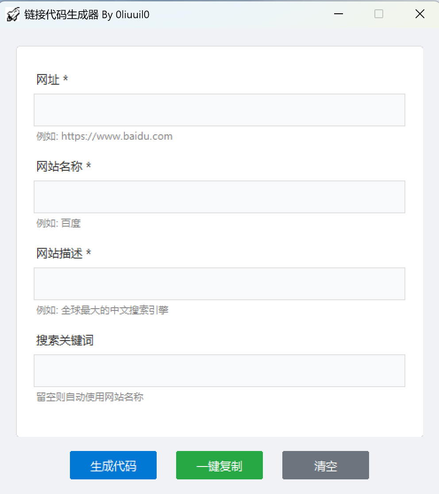

# link_card_generator 链接卡片生成器

[](https://github.com/0liuuil0/LinkCardGenerator/releases/tag/v4.0.0)
[](https://www.python.org/downloads/release/python-3910/)
[](LICENSE)

**Author: [0liuuil0](https://github.com/0liuuil0)**

一款基于 Python 开发的桌面工具，用于快速生成博客或网站常用的链接卡片 HTML 代码。v4.0.0 版本引入了全新的现代化 UI 设计，适配 Win11 视觉风格。

<div align="center">
    
</div>

---

## ✨ 功能特性

*   **现代化 UI (v4.0 新特性)**: 使用 `pywinstyles` 库实现 Windows 11 风格的窗口效果（如 Mica 效果、圆角）。
*   **自定义组件**: 全新绘制的圆角按钮 (`RoundedButton`) 与圆角输入框容器，摆脱原生 Tkinter 的陈旧感。
*   **便捷操作**:
    *   自动提取域名 Favicon。
    *   一键生成 HTML 代码。
    *   一键复制到剪贴板。
    *   支持快捷键操作 (`Enter` 生成, `Ctrl+C` 复制)。
*   **智能补全**: 若未填写搜索关键词，将自动使用网站名称代替。

---

## 🚀 快速开始

### 方式一：下载 Release 版本 (推荐)

无需配置 Python 环境，直接下载可执行文件运行。

请前往 **[Releases](https://github.com/0liuuil0/LinkCardGenerator/releases/tag/v4.0.0)** 页面下载最新版本：

*   下载 `LinkCardGenerator_v4.0.0.exe`。
*   双击运行即可。

### 方式二：从源码运行

1.  **克隆仓库**
    ```bash
    git clone https://github.com/0liuuil0/LinkCardGenerator.git
    cd LinkCardGenerator
    ```

2.  **环境要求**
    本项目基于 **Python 3.9.10** 开发。

3.  **安装依赖**
    为了获得最佳的视觉效果，推荐安装 `pywinstyles`。如果未安装，程序将回退到普通样式。
    ```bash
    pip install pywinstyles
    ```

4.  **运行程序**
    ```bash
    python link_card_generator_v4.0.py
    ```

---

## 📁 项目结构

```
├── link_card_generator_v4.0.py  # v4.0.0 主程序源码
├── beta/                        # 历史版本目录
│   └── ...                      # 包含 v4.0 以下版本的源文件
├── releases/                    # 包含 v4.0 版本的exe文件
└── screenshot.png               # 软件截图
```

---

## 📦 Release Notes (v4.0.0)

此版本是一个重大更新，重构了整个用户界面。

*   **UI 重构**: 引入 `pywinstyles` 依赖，支持 Win11 现代化浅色主题。
*   **组件升级**:
    *   新增 `RoundedButton` 类，实现自定义绘制的圆角按钮，支持悬停变色效果。
    *   使用 Canvas 绘制圆角卡片容器，提升界面美观度。
*   **体验优化**: 优化了输入框焦点样式，增加了提示文字颜色区分。
*   **图标支持**: 自动检测并加载同目录下的图标文件 (`ah9v5-zy2rl.png`)，增加了左上角图标的美观性。

---

## 🛠️ 使用说明

1.  填写 **网址** (必填，如 `https://www.baidu.com`)。
2.  填写 **网站名称** (必填)。
3.  填写 **网站描述** (必填)。
4.  填写 **搜索关键词** (选填，留空则默认使用网站名称)。
5.  点击 **生成代码** 或按下 `Enter` 键。
6.  点击 **一键复制**，将生成的 HTML 粘贴到您的博客源码中。

### 输出示例

生成的代码格式如下：

```html
<a href="https://www.baidu.com" target="_blank" class="link-card" data-name="百度">
    
    <div class="link-info">
        <span class="link-name">百度</span>
        <span class="link-desc">全球最大的中文搜索引擎</span>
    </div>
</a>
```

---

## 📄 许可证

本项目采用 [Apache 2.0 License](LICENSE) 许可证。

---

**⭐ 如果这个项目对你有帮助，欢迎点个 Star！**

**❤ 此README内容使用AI生成及人工修改**
